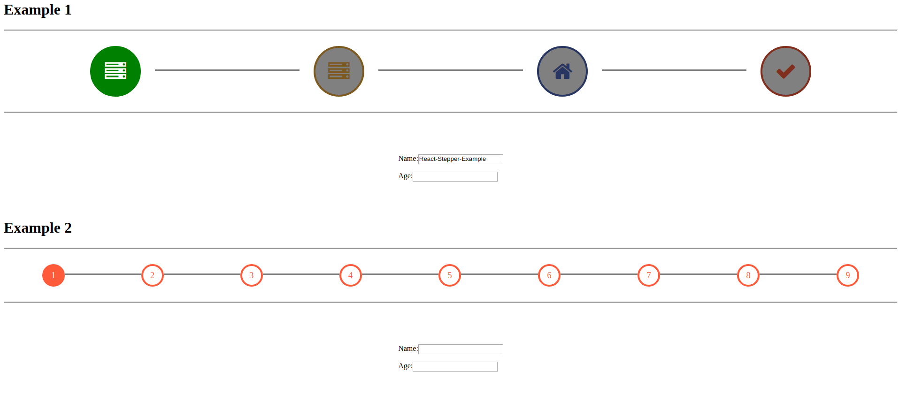

# React-Stepper-Wizard



#### Installation

```npm i react-stepper-wizard```

#### Stepper Prop

Prop | Value
------------ | -------------
style | object
steps | object
currentStep | integer
changeCurrentStep | function


#### Example (See Example folder)
to run example

```git clone https://github.com/tkwant/react-stepper-wizard.git```

```cd react-stepper-wizard```

```npm install```

```npm start```

then open Browser: localhost:9001


You can dissable and enable steps.
You can use an icon (font awesome icon)  or text 
