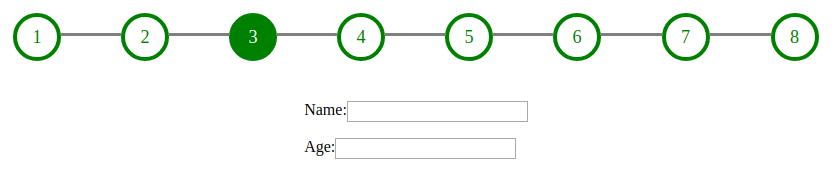

# React-Stepper-Wizard


### Example 1


(___) 
### Example 2

(___) 
## Installation

```npm i react-stepper-wizard```

## Stepper Prop

Prop | Value
------------ | -------------
style | object
steps | object
currentStep | integer
changeCurrentStep | function

## Usage
### App.js
```
import React, { Component } from 'react'
import Stepper from '../dist/components/Stepper'
import Template1 from './components/templates/Template1'
import Template2 from './components/templates/Template2'
import Template3 from './components/templates/Template3'
import Template4 from './components/templates/Template4'
class App extends Component {
  constructor() {
    super()
    this.style = {
      container:{
        paddingTop: 24,          
        paddingBottom: 24,       
      },
      shape:{
        size: 90,
        borderWidth: 4,
        borderRadius: '50%',
      },
      line: {
        borderWidth: 3,
        borderColor: 'gray',
        padding: 20
      }
    }

    this.state = {
      steps : [
        {
          text: '1',
          icon: 'fa-server',
          shapeBorderColor: 'green',
          shapeBackgroundColor: 'white',
          shapeContentColor: 'green',
          enabled: true
        },
        {
          text: '2',
          icon: 'fa-server',
          shapeBorderColor: '#f4b042',
          shapeBackgroundColor: 'white',
          shapeContentColor: '#f4b042',
          enabled: false
        },
        {
          text: '3',
          icon: ' fa-home',
          shapeBorderColor: '#4f6cc1',
          shapeBackgroundColor: 'white',
          shapeContentColor: '#4f6cc1',
          enabled: false
        },
        {
          text: '4',
          icon: 'fa-check',
          shapeBorderColor: '#ff5b3a',
          shapeBackgroundColor: 'white',
          shapeContentColor: '#ff5b3a',
          enabled: false
        }
      ],
      currentStep: 0
    }
    this.changeCurrentStep = this.changeCurrentStep.bind(this)
    this.changeStepEnabled = this.changeStepEnabled.bind(this) 

  }


  changeStepEnabled(stepIndex, enabled) {
    const steps = this.state.steps
    if(steps[stepIndex].enabled != enabled){
      steps[stepIndex].enabled = enabled
      this.setState({steps})
    }
  }


  changeCurrentStep(currentStep) {
    this.setState({currentStep})
  }


  renderContent() {
    switch (this.state.currentStep) {
      case 0: return (<Template1 changeStepEnabled={this.changeStepEnabled} />)
      case 1: return (<Template2 changeStepEnabled={this.changeStepEnabled} />)
      case 2: return (<Template3 changeStepEnabled={this.changeStepEnabled} />)
      case 3: return (<Template4 changeStepEnabled={this.changeStepEnabled} />)


    }
  }

  render() {
    return (
      <div>
        <Stepper
          style={this.style}
          steps={this.state.steps}
          currentStep={this.state.currentStep}
          changeCurrentStep={this.changeCurrentStep}
        />
        {this.renderContent()}
      </div>
    )
  }
}

export default App
```
### Template1.js
```
import React, {Component} from 'react'

class Template extends Component{
    constructor(props) {
        super(props);
    }
    myyMethode(){
        // set step enabled or disabled
        this.props.changeStepEnabled(1, false)
    }
    render() {
        return (
            <div style={{display: 'flex', justifyContent: 'center'}}>
                <button>SEND</button>
            </div>
        );
    }
}


export default Template
```
## Example (See Example folder)
to run example

```git clone https://github.com/tkwant/react-stepper-wizard.git```

```cd react-stepper-wizard```

```npm install```

```npm start```

then open Browser: localhost:9001


You can dissable and enable steps.
You can use an icon (font awesome icon)  or text 
